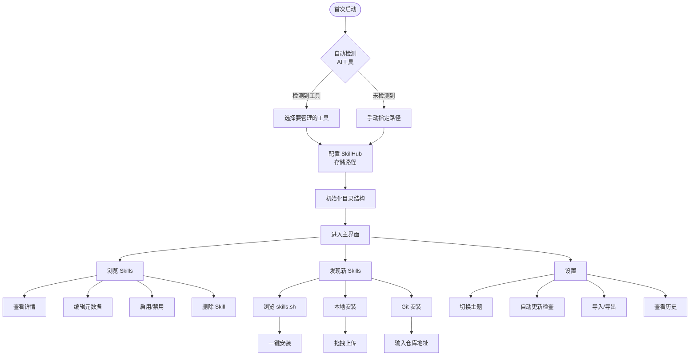

# SkillHub - AI 编程工具 Skill 管理器

## PRD 版本信息

| 版本 | 标题 | 需求内容 | PRD链接 |
|------|------|---------|---------|
| PRD-001 | SkillHub MVP | 统一管理 Claude Code、OpenCode、Trae、Cursor、CodeBuddy 等 AI 编程工具的 Skills。支持自动检测工具、统一存储管理、多标签分类、启用/禁用同步、本地/Git 安装、导入/导出配置、历史记录、暗黑模式等功能。不包含评分、批量操作、跨工具同步。 | — |

---

## 1. 产品概述

### 1.1 产品定位
SkillHub 是一款面向 AI 应用爱好者的桌面应用，用于统一管理多个 AI 编程工具（Claude Code、OpenCode、Trae、Cursor、CodeBuddy）的 Skills。解决 Skill 分散管理、重复安装、版本不一致等问题。

### 1.2 目标用户
- AI 编程工具的重度用户
- 拥有多个 AI 编程工具（Claude Code、OpenCode、Trae、Cursor、CodeBuddy）的开发者
- 喜欢收藏和使用各种 Skills 提升效率的用户

### 1.3 核心价值
1. **统一管理**: Skill 本体统一存储，跨工具复用
2. **快速切换**: 一键启用/禁用，秒级同步到各工具
3. **发现安装**: 浏览 skills.sh 热门，支持本地/Git 多种安装方式
4. **灵活组织**: 多标签分类、备注、搜索

---

## 2. 用户旅程地图

### 2.1 核心流程图



### 2.2 业务主流程

```
┌─────────────────────────────────────────────────────────┐
│  Phase 1: 初始化配置                                     │
│  - 首次启动检测各AI工具                                   │
│  - 用户选择 SkillHub 存储路径                            │
│  - 勾选要管理的工具                                      │
│  - 创建目录结构                                          │
└─────────────────────────────────────────────────────────┘
                           ↓
┌─────────────────────────────────────────────────────────┐
│  Phase 2: Skill 浏览与管理                               │
│  - 查看已安装的 Skills（卡片列表）                        │
│  - 添加标签、备注                                         │
│  - 启用/禁用同步到各工具                                  │
│  - 查看详情、更新、删除                                   │
└─────────────────────────────────────────────────────────┘
                           ↓
┌─────────────────────────────────────────────────────────┐
│  Phase 3: Skill 发现与安装                               │
│  - 浏览 skills.sh 热门/趋势                              │
│  - 本地安装（拖拽/选择）                                  │
│  - Git 安装（多种格式）                                   │
└─────────────────────────────────────────────────────────┘
                           ↓
┌─────────────────────────────────────────────────────────┐
│  Phase 4: 设置与配置                                     │
│  - 切换主题（暗黑/亮色）                                  │
│  - 自动更新检查                                          │
│  - 导入/导出配置                                         │
│  - 查看操作历史（10天）                                   │
└─────────────────────────────────────────────────────────┘
```

---

## 3. 用户故事

---

### US-01: 首次启动向导

**故事 ID**: US-01  
**标题**: 首次启动自动检测与配置  
**优先级**: P0  
**涉及页面**: 启动向导

#### 用户故事
**作为** AI 应用爱好者  
**我希望** 首次打开应用时自动检测已安装的 AI 编程工具并配置 SkillHub  
**从而** 快速开始统一管理 Skills

#### 业务规则与逻辑

**1. 自动检测工具**
检测以下路径判断工具是否安装：
- `~/.claude/` → Claude Code
- `~/.config/opencode/` → OpenCode
- `~/.trae-cn/` → Trae
- `~/.cursor/` → Cursor
- `~/.codebuddy/` → CodeBuddy

**2. SkillHub 目录配置**
- 默认位置：`~/.skill-hub/`
- 用户可修改为自定义路径
- 路径验证：检查是否可读写、是否为空目录

**3. 初始化操作**
创建以下目录结构：
```
~/.skill-hub/                    # SkillHub 管理中心（用户可自定义）
├── skills/                      # 所有 Skill 本体（通用存储）
├── config/                      # 各工具启用配置
│   ├── claude-code.json
│   ├── opencode.json
│   ├── cursor.json
│   ├── codebuddy.json
│   └── trae.json
├── metadata/
│   └── skills-metadata.json     # 标签、备注
├── history/
│   └── operations.log           # 操作历史（10天）
└── settings.json               # 应用全局设置
```

#### 界面线框图

```
┌─────────────────────────────────────────────────────────────┐
│  🚀 欢迎使用 SkillHub                                        │
│                                                              │
│  步骤 1/2: 配置存储位置                                       │
│                                                              │
│  SkillHub 存储位置:                                          │
│  ┌─────────────────────────────────────┐ ┌────────┐         │
│  │ ~/.skill-hub/                       │ │ 浏览...│         │
│  └─────────────────────────────────────┘ └────────┘         │
│                                                              │
│  此目录将用于存储所有 Skill 和配置信息                        │
│                                                              │
│                                    [下一步 →]               │
└─────────────────────────────────────────────────────────────┘

┌─────────────────────────────────────────────────────────────┐
│  🚀 欢迎使用 SkillHub                                        │
│                                                              │
│  步骤 2/2: 选择要管理的 AI 工具                               │
│                                                              │
│  检测到以下工具:                                             │
│                                                              │
│  ☑️ Claude Code        (~/.claude/)                         │
│  ☑️ OpenCode           (~/.config/opencode/)                │
│  ☐ Trae               (未检测到)                            │
│  ☑️ Cursor            (~/.cursor/)                          │
│  ☐ CodeBuddy          (未检测到)                            │
│                                                              │
│  [+ 手动添加工具]                                            │
│                                                              │
│  [← 上一步]          [完成设置]                             │
└─────────────────────────────────────────────────────────────┘
```

#### 验收标准
- [ ] 启动时检测 SkillHub 目录是否已配置，未配置则显示向导
- [ ] 自动检测 5 个工具的已安装状态
- [ ] 用户可以修改 SkillHub 存储路径
- [ ] 用户可以通过 Checkbox 选择要管理的工具
- [ ] 支持手动添加未检测到的工具（输入路径）
- [ ] 点击"完成"后创建目录结构和配置文件
- [ ] 配置完成后进入主界面，下次不再显示向导

---

### US-02: Skill 浏览与管理

**故事 ID**: US-02  
**标题**: 主界面浏览与管理 Skills  
**优先级**: P0  
**涉及页面**: 主界面（我的 Skills）

#### 用户故事
**作为** AI 应用爱好者  
**我希望** 在主界面查看和管理所有已安装的 Skills  
**从而** 了解每个 Skill 的信息并控制启用状态

#### 业务规则与逻辑

**1. 卡片列表显示**
- 显示所有已安装的 Skills
- 每个卡片显示：名称、标签、分类、启用状态、安装时间
- 操作按钮直接显示：[👁查看] [🔄更新] [🗑️删除]

**2. 启用状态显示**
- 用图标显示该 Skill 在哪些工具中已启用
- 例如：🟢 Claude  🟢 OpenCode  ⚪ Cursor

**3. 展开详情面板**
- 点击展开显示完整详情和元数据编辑
- 支持编辑：分类、标签（多个）、备注
- 各工具独立启用/禁用开关

**4. 搜索功能**
- 搜索范围：名称、来源、描述、分类、标签、备注
- 实时过滤

#### 界面线框图

**主界面 - 整体布局:**
```
┌─────────────────────────────────────────────────────────────────────────────┐
│  Header: Logo + 搜索框 + [安装] [设置] 按钮                                  │
├─────────────────────────────────────────────────────────────────────────────┤
│  Stats Bar: 总计/已启用数量 + 5个工具连接状态                                │
├────────────────┬────────────────────────────────────────────────────────────┤
│  Sidebar       │  Main Content (单列卡片列表)                               │
│  232px         │                                                            │
│                │  ┌──────────────────────────────────────────────────────┐  │
│  📁 分类       │  │ 🚀 skill-name                    [👁][🔄][🗑][▼]    │  │
│  全部 (12)     │  │    来源 · 日期 · 分类                               │  │
│  前端 (5)      │  │    🏷️ 标签                    🟢Claude 🟢OpenCode...│  │
│  后端 (3)      │  ├──────────────────────────────────────────────────────┤  │
│  设计 (2)      │  │    [展开详情面板]                                   │  │
│  DevOps (2)    │  │    描述、分类选择、标签编辑、备注                     │  │
│                │  │    工具同步开关 (5个)                                │  │
│  🏷️ 标签       │  └──────────────────────────────────────────────────────┘  │
│  (动态显示)    │                                                            │
│                │                                                            │
│  🔧 工具筛选   │                                                            │
│  ☑ Claude     │                                                            │
│  ☑ OpenCode   │                                                            │
│  ☐ Cursor     │                                                            │
│  ☐ CodeBuddy  │                                                            │
│  ☐ Trae       │                                                            │
└────────────────┴────────────────────────────────────────────────────────────┘
```

**Skill 卡片详情:**
```
┌──────────────────────────────────────────────────────────────────────────┐
│ 🚀 vercel-react-best-practices                              [👁][🔄][🗑][▼]│
│    2024-01-15 · 前端开发                                                  │
│                                                                           │
│    🏷️ 前端  🏷️ React  🏷️ Vercel       🟢Claude 🟢OpenCode ⚪Cursor...  │
│    └────────────────────────────┘   └────────────────────────────────┘  │
│           标签（左侧）                        工具状态（右侧）              │
└──────────────────────────────────────────────────────────────────────────┘

展开后:
┌──────────────────────────────────────────────────────────────────────────┐
│ 🚀 vercel-react-best-practices                              [👁][🔄][🗑][▲]│
│    2024-01-15 · 前端开发                                                  │
│    🏷️ 前端  🏷️ React  🏷️ Vercel       🟢Claude 🟢OpenCode ⚪Cursor...  │
│──────────────────────────────────────────────────────────────────────────│
│  Skill 来源                                                              │
│  🔗 https://github.com/vercel-labs/agent-skills ↗                          │
│                                                                           │
│  编辑元数据                              同步到工具                       │
│  ┌─────────────────────────┐            ┌─────────────────────────────┐  │
│  │ 分类: [前端开发 ▼]       │            │ Claude     [🟢 开关]        │  │
│  │ 标签: [前端][React][+]  │            │ OpenCode   [🟢 开关]        │  │
│  │ 备注: [学习笔记...]      │            │ Cursor     [⚪ 开关]        │  │
│  └─────────────────────────┘            │ CodeBuddy  [⚪ 开关]        │  │
│                                         │ Trae       [⚪ 开关]        │  │
│                                         └─────────────────────────────┘  │
└──────────────────────────────────────────────────────────────────────────┘
```

**SKILL.md 查看器:**
```
┌─────────────────────────────────────────────────────────────────────┐
│  ← 返回          vercel-react-best-practices / SKILL.md             │
├─────────────────────────────────────────────────────────────────────┤
│  [文件目录]  [渲染视图]  [代码视图]                                  │
│                                                                     │
│  ┌──────────────┬───────────────────────────────────────────────┐  │
│  │ 📁 skills/   │                                               │  │
│  │   📄 SKILL.md│   # React Best Practices                      │  │
│  │   📄 README.md│                                              │  │
│  │ 📁 examples/ │   ## Component Structure                      │  │
│  │   📄 basic.tsx│                                              │  │
│  │   📄 advanced.tsx│  1. Use functional components...          │  │
│  │              │                                               │  │
│  │              │  ## Hooks Guidelines                          │  │
│  │              │                                               │  │
│  │              │  1. Always use `use` prefix...                │  │
│  │              │                                               │  │
│  └──────────────┴───────────────────────────────────────────────┘  │
└─────────────────────────────────────────────────────────────────────┘
```

#### 验收标准
- [ ] 左侧 232px 侧边栏，包含分类文件夹列表、标签筛选、工具筛选复选框
- [ ] 以单列卡片列表形式显示所有已安装 Skills
- [ ] 每个卡片显示：分类图标、名称、来源/日期/分类、标签、工具状态（圆点+名称）
- [ ] 标签和工具状态在同一行：标签在左侧，工具状态在右侧
- [ ] 操作按钮在卡片右上角：查看、更新、删除、展开
- [ ] 点击展开显示完整详情和元数据编辑（卡片内展开）
- [ ] 可以编辑分类、标签（多标签）、备注
- [ ] 可以为每个工具独立启用/禁用 Skill（Toggle 开关）
- [ ] 有更新时显示更新按钮（带动画提示）
- [ ] 可以删除 Skill（从 SkillHub 移除）
- [ ] 可以查看 SKILL.md（三视图：文件目录/渲染/代码）
- [ ] 搜索功能支持名称、来源、描述、分类、标签、备注

---

### US-03: 发现与安装

**故事 ID**: US-03  
**标题**: 发现与安装新 Skills  
**优先级**: P0  
**涉及页面**: 安装页面、浏览技能页、本地安装页、Git 安装页

#### 用户故事
**作为** AI 应用爱好者  
**我希望** 发现新的 Skills 并通过多种方式安装  
**从而** 扩展我的 Skill 库

#### 业务规则与逻辑

**1. 安装入口页面**
三个卡片入口：浏览技能、本地安装、Git 安装

**2. 浏览技能页（skills.sh）**
- 爬取 https://skills.sh/ 热门列表
- 混合显示已安装和未安装的 Skills
- 已安装：显示勾选标记
- 未安装：显示 [安装] 按钮
- 有更新：显示 [更新] 按钮
- 支持搜索 skills.sh

**3. 本地安装页**
- 拖拽区域：支持文件夹、.zip、.skill 文件
- 或点击选择文件
- 支持拖拽多个文件批量安装

**4. Git 安装页**
- 输入框支持三种格式：
  - `https://github.com/user/repo`
  - `user/repo`（GitHub 简写）
  - `https://github.com/user/repo/tree/main/skills/my-skill`（指定子路径）
- 解析后显示仓库信息，确认后安装

#### 界面线框图

**安装入口:**
```
┌─────────────────────────────────────────────────────────────────────┐
│  ← 返回                        安装 Skills                          │
├─────────────────────────────────────────────────────────────────────┤
│                                                                     │
│     ┌─────────────────┐  ┌─────────────────┐  ┌─────────────────┐  │
│     │      🌐         │  │      📁         │  │      🔗         │  │
│     │                 │  │                 │  │                 │  │
│     │    浏览技能      │  │    本地安装      │  │    Git 安装     │  │
│     │                 │  │                 │  │                 │  │
│     │   skills.sh     │  │  拖拽文件夹或     │  │   仓库地址      │  │
│     │   热门榜单      │  │  压缩包安装       │  │   一键安装      │  │
│     │                 │  │                 │  │                 │  │
│     └─────────────────┘  └─────────────────┘  └─────────────────┘  │
│                                                                     │
└─────────────────────────────────────────────────────────────────────┘
```

**浏览技能页:**
```
┌─────────────────────────────────────────────────────────────────────┐
│  ← 返回                    浏览 Skills.sh 热门                       │
├─────────────────────────────────────────────────────────────────────┤
│  🔍 搜索 skills.sh...                                               │
├─────────────────────────────────────────────────────────────────────┤
│                                                                     │
│  热门 Skills                                                        │
│                                                                     │
│  ┌──────────────────────────────────────────────────────────────┐  │
│  │ ☑️ frontend-design                                            │  │
│  │    Anthropic  ⭐ 47.0K  installs                              │  │
│  │    [已安装 ✓]                                                 │  │
│  └──────────────────────────────────────────────────────────────┘  │
│                                                                     │
│  ┌──────────────────────────────────────────────────────────────┐  │
│  │ ☐ web-design-guidelines                                      │  │
│  │    Vercel Labs  ⭐ 77.5K  installs                           │  │
│  │    React 前端开发设计规范指南                                 │  │
│  │    [安装]                                                    │  │
│  └──────────────────────────────────────────────────────────────┘  │
│                                                                     │
│  ┌──────────────────────────────────────────────────────────────┐  │
│  │ ☑️ vercel-react-best-practices                               │  │
│  │    Vercel Labs  ⭐ 102.6K  installs                          │  │
│  │    [更新]  ← 本地版本较旧                                     │  │
│  └──────────────────────────────────────────────────────────────┘  │
│                                                                     │
└─────────────────────────────────────────────────────────────────────┘
```

**本地安装页:**
```
┌─────────────────────────────────────────────────────────────────────┐
│  ← 返回                        本地安装                              │
├─────────────────────────────────────────────────────────────────────┤
│                                                                     │
│  ┌──────────────────────────────────────────────────────────────┐  │
│  │                                                               │  │
│  │                      📦 拖拽到此处                            │  │
│  │                                                               │  │
│  │            支持: 文件夹 / .zip / .skill                       │  │
│  │                                                               │  │
│  │              [或点击选择文件]                                 │  │
│  │                                                               │  │
│  └──────────────────────────────────────────────────────────────┘  │
│                                                                     │
│  已选择: my-skill/                                                  │
│  [取消]                                          [确认安装]        │
│                                                                     │
└─────────────────────────────────────────────────────────────────────┘
```

**Git 安装页:**
```
┌─────────────────────────────────────────────────────────────────────┐
│  ← 返回                        Git 安装                              │
├─────────────────────────────────────────────────────────────────────┤
│                                                                     │
│  Git 仓库地址:                                                       │
│  ┌──────────────────────────────────────────────────────────────┐  │
│  │ https://github.com/vercel-labs/agent-skills                  │  │
│  └──────────────────────────────────────────────────────────────┘  │
│                                                                     │
│  支持的格式:                                                         │
│  • https://github.com/user/repo                                     │
│  • user/repo (GitHub 简写)                                         │
│  • https://github.com/user/repo/tree/main/skills/my-skill           │
│    (指定子路径)                                                     │
│                                                                     │
│  [解析并安装]                                                        │
│                                                                     │
└─────────────────────────────────────────────────────────────────────┘
```

#### 验收标准
- [ ] 三个入口卡片清晰展示
- [ ] 浏览页正确爬取并显示 skills.sh 热门列表
- [ ] 正确区分已安装/未安装/有更新状态
- [ ] 可以一键安装/更新 Skills
- [ ] 可以查看 Skill 详情
- [ ] 本地安装支持拖拽和手动选择
- [ ] 支持 zip、.skill、文件夹格式
- [ ] Git 安装支持三种 URL 格式
- [ ] 安装成功后自动刷新列表

---

### US-04: 导入/导出配置

**故事 ID**: US-04
**标题**: 导入/导出 SkillHub 配置
**优先级**: P0
**涉及页面**: 设置页面 - 导入/导出

#### 用户故事
**作为** AI 应用爱好者
**我希望** 导出和导入 SkillHub 完整配置
**从而** 备份所有数据或迁移到新设备

#### 业务规则与逻辑

**1. 导出功能**
- 导出格式：.zip 压缩包
- 导出内容（完整导出）：
  - Skills 文件本体（skills/）
  - Skills 元数据（标签、备注、分类）
  - 工具启用配置（config/）
  - 应用设置（settings.json）
  - 自定义工具配置（custom-tools.json）
  - Git 缓存（git/）
  - **不导出**：历史记录（history/）

**2. 导入功能**
- 选择 .zip 备份文件
- 解析 manifest.json 并恢复数据
- 冲突处理：询问是否覆盖

**3. 导出文件结构**
```
skillhub-backup-2024-01-15.zip
├── manifest.json          # 元数据清单
├── skills/                # Skill 文件本体
│   ├── skill-1/
│   │   └── SKILL.md
│   └── skill-2/
├── git/                   # Git 缓存目录
│   └── vercel-labs-agent-skills/
└── config/                # 工具启用配置
    ├── claude-code.json
    └── ...
```

**4. manifest.json 结构**
```json
{
  "skillhub_version": "1.0",
  "export_date": "2024-01-15T10:30:00Z",
  "skills": [
    {
      "name": "vercel-react-best-practices",
      "source": "github/vercel-labs/agent-skills",
      "source_type": "github",
      "tags": ["前端", "React"],
      "notes": "Vercel 团队的最佳实践",
      "category": "前端开发",
      "tools_enabled": ["claude-code", "cursor"],
      "installed_date": "2024-01-15T10:00:00Z"
    }
  ],
  "custom_tools": [
    {
      "name": "MyTool",
      "path": "/custom/path/.mytool/skills/",
      "added_date": "2024-01-10T08:00:00Z"
    }
  ],
  "git_cache": [
    {
      "repo_url": "https://github.com/vercel-labs/agent-skills",
      "local_path": "git/vercel-labs-agent-skills",
      "commit_hash": "abc123def456",
      "branch": "main",
      "last_pull": "2024-01-15T09:00:00Z"
    }
  ],
  "settings": {
    "skillhub_path": "~/.skill-hub",
    "theme": "system",
    "auto_update_check": true,
    "update_frequency": "daily"
  }
}
```

#### 界面线框图

```
┌─────────────────────────────────────────────────────────────────────┐
│  设置 / 导入与导出                                                   │
├─────────────────────────────────────────────────────────────────────┤
│                                                                     │
│  导出配置                                                           │
│  ┌──────────────────────────────────────────────────────────────┐  │
│  │                                                               │  │
│  │  将导出以下内容：                                              │  │
│  │  • Skills 文件本体及元数据                                     │  │
│  │  • 工具启用配置                                                │  │
│  │  • 应用设置                                                    │  │
│  │  • 自定义工具配置                                              │  │
│  │  • Git 缓存                                                    │  │
│  │                                                               │  │
│  │  预计大小: ~15 MB                                              │  │
│  │                                                               │  │
│  │  [导出到文件...]                                               │  │
│  └──────────────────────────────────────────────────────────────┘  │
│                                                                     │
│  导入配置                                                           │
│  ┌──────────────────────────────────────────────────────────────┐  │
│  │ 选择备份文件:                                                 │  │
│  │ ┌─────────────────────────────────────┐ ┌────────┐           │  │
│  │ │                                     │ │ 浏览...│           │  │
│  │ └─────────────────────────────────────┘ └────────┘           │  │
│  │                                                               │  │
│  │ 冲突处理:                                                     │  │
│  │ ○ 跳过已有 Skill                                              │  │
│  │ ● 覆盖并更新                                                  │  │
│  │                                                               │  │
│  │ [开始导入]                                                    │  │
│  └──────────────────────────────────────────────────────────────┘  │
│                                                                     │
└─────────────────────────────────────────────────────────────────────┘
```

#### 验收标准
- [ ] 支持导出为 .zip 压缩包格式
- [ ] 导出包含：Skills 本体、元数据、工具配置、应用设置、自定义工具、Git 缓存
- [ ] 不导出历史记录
- [ ] 支持从 .zip 文件导入
- [ ] 导入时可以选择冲突处理方式
- [ ] 导入成功后刷新主界面

---

### US-05: 设置页面

**故事 ID**: US-05  
**标题**: 应用设置管理  
**优先级**: P1  
**涉及页面**: 设置页面

#### 用户故事
**作为** AI 应用爱好者  
**我希望** 自定义应用外观和行为  
**从而** 获得更好的使用体验

#### 业务规则与逻辑

**1. 外观设置**
- 主题模式：暗黑 / 亮色 / 跟随系统

**2. 更新设置**
- 自动检查更新：开/关
- 检查频率：每次启动 / 每天 / 每周

**3. 存储设置**
- 显示当前 SkillHub 路径
- 支持迁移到新路径
- 显示存储空间使用情况

**4. 路径迁移功能**
- **迁移触发**: 用户点击"更改位置"按钮选择新路径
- **迁移检测**: 自动检测原路径是否有数据
  - 检测原路径的 Skills 数量（目录形式统计）
  - 不显示数据大小（避免性能问题）
- **迁移确认**:
  - 仅两个选项：[迁移数据] [取消]
  - 显示原路径、新路径、Skills 数量
  - 移除"不迁移"选项（避免新路径为空的困惑）
- **迁移内容**: 完整迁移所有数据
  - `skills/` - Skills 本体
  - `metadata/` - 元数据
  - `git/` - Git 克隆缓存
  - `history/` - 操作日志
  - `config/` - 工具配置
  - `settings.json` - 应用设置
  - `custom-tools.json` - 自定义工具
- **迁移后处理**:
  - 提醒用户自行检查和删除原路径数据
  - 不自动删除（避免文件占用导致删除失败）
  - 显示成功提示和原路径信息

#### 界面线框图

```
┌─────────────────────────────────────────────────────────────────────┐
│  设置                                                                │
├─────────────────────────────────────────────────────────────────────┤
│                                                                     │
│  ┌─ 外观 ───────────────────────────────────────────────────────┐  │
│  │                                                                │  │
│  │  主题模式:                                                    │  │
│  │  ○ 暗黑模式    ○ 亮色模式    ● 跟随系统                        │  │
│  │                                                                │  │
│  └────────────────────────────────────────────────────────────────┘  │
│                                                                     │
│  ┌─ 更新 ────────────────────────────────────────────────────────┐  │
│  │                                                                │  │
│  │  ☑️ 自动检查更新                                               │  │
│  │                                                                │  │
│  │  检查频率:    ○ 每次启动    ● 每天    ○ 每周                  │  │
│  │                                                                │  │
│  └────────────────────────────────────────────────────────────────┘  │
│                                                                     │
│  ┌─ 存储 ────────────────────────────────────────────────────────┐  │
│  │                                                                │  │
│  │  SkillHub 路径:                                               │  │
│  │  ~/.skill-hub/                                                │  │
│  │  [更改位置]                                                   │  │
│  │                                                                │  │
│  │  存储空间: 已用 145 MB / 总 Skills: 12                        │  │
│  │                                                                │  │
│  └────────────────────────────────────────────────────────────────┘  │
│                                                                     │
│  ┌─ 数据 ────────────────────────────────────────────────────────┐  │
│  │                                                                │  │
│  │  [查看历史记录]        [导入/导出配置]        [重置所有数据]   │  │
│  │                                                                │  │
│  └────────────────────────────────────────────────────────────────┘  │
│                                                                     │
└─────────────────────────────────────────────────────────────────────┘
```

#### 验收标准
- [ ] 可以切换主题（暗黑/亮色/跟随系统）
- [ ] 可以开启/关闭自动检查更新
- [ ] 可以设置检查频率
- [ ] 显示当前 SkillHub 路径
- [ ] 支持迁移到新路径
  - [ ] 正确检测原路径的 Skills 数量（目录统计）
  - [ ] 迁移确认对话框仅显示 [迁移数据] [取消] 两个按钮
  - [ ] 完整迁移所有 7 项数据（skills、metadata、git、history、config、settings.json、custom-tools.json）
  - [ ] 迁移成功后提醒用户自行删除原路径
  - [ ] 不自动删除原路径数据
- [ ] 显示存储空间使用情况

---

### US-06: 历史记录

**故事 ID**: US-06  
**标题**: 操作历史记录  
**优先级**: P1  
**涉及页面**: 设置页面 - 历史记录

#### 用户故事
**作为** AI 应用爱好者  
**我希望** 查看操作历史记录  
**从而** 了解 Skill 的变更情况

#### 业务规则与逻辑

**1. 记录的操作类型**
- 安装 Skill
- 更新 Skill
- 删除 Skill
- 启用 Skill（记录工具）
- 禁用 Skill（记录工具）

**2. 保留策略**
- 保留最近 10 天的记录
- 超过 10 天的自动清理

**3. 显示信息**
- 操作时间
- 操作类型
- Skill 名称
- 相关工具（启用/禁用时）

#### 界面线框图

```
┌─────────────────────────────────────────────────────────────────────┐
│  设置 / 历史记录                                                     │
├─────────────────────────────────────────────────────────────────────┤
│                                                                     │
│  最近 10 天的操作记录                                                │
│                                                                     │
│  ┌──────────────────────────────────────────────────────────────┐  │
│  │ 今天 14:32          安装        frontend-design              │  │
│  ├──────────────────────────────────────────────────────────────┤  │
│  │ 今天 14:30          启用        vercel-react-best-practices  │  │
│  │                     工具: Claude Code, Cursor               │  │
│  ├──────────────────────────────────────────────────────────────┤  │
│  │ 今天 11:15          更新        web-design-guidelines        │  │
│  ├──────────────────────────────────────────────────────────────┤  │
│  │ 昨天 16:45          禁用        frontend-design              │  │
│  │                     工具: OpenCode                          │  │
│  ├──────────────────────────────────────────────────────────────┤  │
│  │ 昨天 09:20          删除        old-skill                    │  │
│  └──────────────────────────────────────────────────────────────┘  │
│                                                                     │
│                              [清空历史记录]                         │
│                                                                     │
│  提示: 历史记录仅保留最近 10 天                                     │
│                                                                     │
└─────────────────────────────────────────────────────────────────────┘
```

#### 验收标准
- [ ] 记录所有操作（安装、更新、删除、启用、禁用）
- [ ] 显示操作时间、类型、Skill 名称
- [ ] 启用/禁用记录具体工具
- [ ] 仅保留最近 10 天记录
- [ ] 支持清空历史记录

---

## 4. 技术架构

### 4.1 数据存储结构

```
~/.skill-hub/
├── skills/                          # Skill 本体（通用存储）
│   ├── author-skillname/
│   │   ├── SKILL.md
│   │   └── ...
│   └── ...
├── config/                          # 各工具启用配置
│   ├── claude-code.json             # { "enabled": ["skill-1", "skill-2"] }
│   ├── opencode.json
│   ├── cursor.json
│   ├── codebuddy.json
│   └── trae.json
├── metadata/                        # 每个 Skill 独立 JSON 文件
│   ├── author-skillname.json        # 标签、备注、分类
│   └── ...
├── git/                             # Detached .git 目录（用于更新检测）
│   └── owner-repo/
├── history/
│   └── operations.log               # 操作历史（10天）
├── settings.json                    # 应用全局设置（含 GitHub Token、同步配置）
├── custom-tools.json                # 用户自定义工具
├── .gitignore                       # 同步时自动创建
└── .git/                            # 配置同步后创建
```

### 4.2 启用/禁用机制

**方案**: Symlink/Junction 目录链接（v1.4 起，取代旧版复制）

```
启用流程:
1. 检查 Skill 是否在 ~/.skill-hub/skills/ 中
2. 创建目录链接到目标工具路径（Windows: mklink /J Junction; Unix: os.Symlink）
3. 更新 config/claude-code.json（记录已启用列表）

禁用流程:
1. 检测目标路径类型：
   - 目录链接（Junction/Symlink）→ 仅删除链接节点，保留源文件
   - 普通目录（旧版复制遗留）→ 递归删除整个文件夹
2. 更新 config/claude-code.json
```

> **注意**：从 Sync 拉取的 Skill 使用目录链接以节省磁盘空间；普通安装仍使用复制方式。删除时自动识别链接类型，防止误删源目录。

### 4.3 支持的工具路径

| AI 工具 | 全局路径 | 状态 |
|---------|---------|------|
| Claude Code | `~/.claude/skills/` | ✅ 标准支持 |
| OpenCode | `~/.config/opencode/skills/` | ✅ 标准支持 |
| Cursor | `~/.cursor/skills/` | ✅ 标准支持 |
| CodeBuddy | `~/.codebuddy/skills/` | ✅ 标准支持 |
| Trae | `~/.trae-cn/skills/` | ✅ 标准支持 |

---

## 5. UI 设计规范

### 5.1 设计风格
- **美学方向**: 赛博朋克/科技风格（深色主题为主）
- **设计参考**: 类似 Linear/Raycast 的专业感，但更强调科技感

### 5.2 配色方案

| 用途 | 颜色代码 | 说明 |
|------|---------|------|
| 深色背景 | `#0a0a0f` | 主背景色 |
| 面板背景 | `#12121a` | 卡片、侧边栏背景 |
| 边框色 | `#1e1e2e` | 分割线、边框 |
| 主色调 | `#00d4aa` | 青绿色，用于强调、按钮、激活状态 |
| 辅助色 | `#a855f7` | 紫色，用于渐变、次要强调 |

### 5.3 字体规范

| 类型 | 字体 | 用途 |
|------|------|------|
| 等宽字体 | JetBrains Mono | Skill 名称、代码、路径 |
| 正文字体 | Inter | 描述、标签、正文内容 |

### 5.4 图标系统
- **图标库**: Font Awesome 6.x
- **关键图标**:
  - 查看: `fa-eye`
  - 更新: `fa-sync-alt`
  - 删除: `fa-trash-alt`
  - 展开: `fa-chevron-down`

### 5.5 组件样式

**玻璃面板效果 (Glass Panel)**
```css
background: rgba(18, 18, 26, 0.7);
backdrop-filter: blur(20px);
border: 1px solid rgba(255, 255, 255, 0.05);
```

**渐变文字**
```css
background: linear-gradient(135deg, #00d4aa 0%, #a855f7 100%);
-webkit-background-clip: text;
-webkit-text-fill-color: transparent;
```

**Toggle 开关**
- 开启状态: 青绿色渐变背景
- 关闭状态: 深灰色背景 (#1e1e2e)
- 动画: 平滑过渡 (0.3s)

### 5.6 交互效果
- **卡片悬停**: 轻微上浮 (-4px) + 阴影加深
- **展开动画**: max-height 过渡 (0.5s cubic-bezier)
- **按钮悬停**: 边框变为主色 + 颜色变化
- **删除按钮**: 悬停时变为红色

### 5.7 原型文件清单

| 页面 | 文件 | 说明 |
|------|------|------|
| 主界面 | `SkillHub_UI.html` | Skill 卡片列表、侧边栏筛选 |
| 设置页面 | `SkillHub_Settings.html` | 外观、更新、存储、数据管理 |
| 启动向导 | `SkillHub_Wizard.html` | 首次启动配置 |
| Git 安装 | `SkillHub_GitInstall.html` | 从 GitHub 仓库安装 |
| 本地安装 | `SkillHub_LocalInstall.html` | 拖拽/选择本地文件 |
| SKILL.md 查看器 | `SkillHub_Viewer.html` | 文件目录、渲染视图、代码视图 |
| 历史记录 | `SkillHub_History.html` | 操作历史 |
| 导入/导出 | `SkillHub_ImportExport.html` | 备份配置 |

---

## 6. 验收标准汇总

### P0 功能（核心 MVP）

| US | 验收项 | 状态 |
|---|---|---|
| US-01 | 启动向导自动检测工具 | ☐ |
| US-01 | 用户配置 SkillHub 路径 | ☐ |
| US-01 | Checkbox 选择管理工具 | ☐ |
| US-01 | 初始化目录结构 | ☐ |
| US-02 | 卡片列表显示 Skills | ☐ |
| US-02 | 显示标签、分类、启用状态 | ☐ |
| US-02 | 操作按钮前置（查看/更新/删除） | ☐ |
| US-02 | 展开编辑元数据 | ☐ |
| US-02 | 各工具独立启用/禁用 | ☐ |
| US-02 | SKILL.md 三视图查看 | ☐ |
| US-02 | 搜索功能 | ☐ |
| US-03 | 三个安装入口 | ☐ |
| US-03 | skills.sh 热门浏览 | ☐ |
| US-03 | 本地拖拽安装 | ☐ |
| US-03 | Git 安装（三种格式） | ☐ |
| US-04 | JSON 格式导入/导出 | ☐ |

### P1 功能（增强体验）

| US | 验收项 | 状态 |
|---|---|---|
| US-05 | 主题切换（暗黑/亮色/跟随系统） | ☐ |
| US-05 | 自动更新检查 | ☐ |
| US-05 | 存储路径迁移 | ☑ |
| US-05 | 完整迁移所有 7 项数据 | ☑ |
| US-05 | 两按钮迁移确认对话框 | ☑ |
| US-05 | 正确统计 Skills 数量 | ☑ |
| US-05 | 提醒用户自行删除原路径 | ☑ |
| US-06 | 操作历史记录 | ☐ |
| US-06 | 10天自动清理 | ☐ |

---

## 7. 非目标（明确不做）

| 功能 | 原因 | 后续版本 |
|---|---|---|
| Skill 评分 | 用户明确不需要 | ❌ |
| 批量操作 | 用户明确不需要 | ❌ |
| 跨工具同步 | 用户明确不需要 | ❌ |
| iFlyCode / aiXcoder 支持 | 不支持标准 Skill 系统 | ❌ |
| 云同步（GitHub） | 已在 v1.x 实现 Git-based 同步备份 | 🚀 已完成 |
| Skill 分享社区 | MVP 范围外 | ✅ v2.0 |
| AI 推荐 Skill | MVP 范围外 | ✅ v2.0 |

---

## 8. 附录

### 8.1 命名规范

**Skill 命名**（自动处理）：
- 原始名称：`vercel-labs/agent-skills`
- 本地存储名：`vercel-labs-agent-skills`
- 显示名称：`vercel-labs/agent-skills`（保持原样）

**标签命名**：
- 用户自由输入
- 自动去重、去空格

### 8.2 错误处理

| 场景 | 处理方式 |
|---|---|
| 工具路径不存在 | 提示用户检查或重新配置 |
| Skill 文件损坏 | 标记为异常，提供重新安装选项 |
| 网络错误（skills.sh） | 显示缓存数据，提示检查网络 |
| 权限不足 | 提示以管理员身份运行 |
| 磁盘空间不足 | 提示清理空间 |

### 8.3 性能要求

- 启动时间 < 3 秒
- 加载 100 个 Skill < 1 秒
- 搜索响应 < 100ms
- 启用/禁用操作 < 500ms

---

**文档版本**: v1.5
**最后更新**: 2026-06-23
**更新内容**: Skill 来源 URL 可点击、搜索含备注、`GetSkill` 修复本地 SourceURL
**作者**: SkillHub Team
